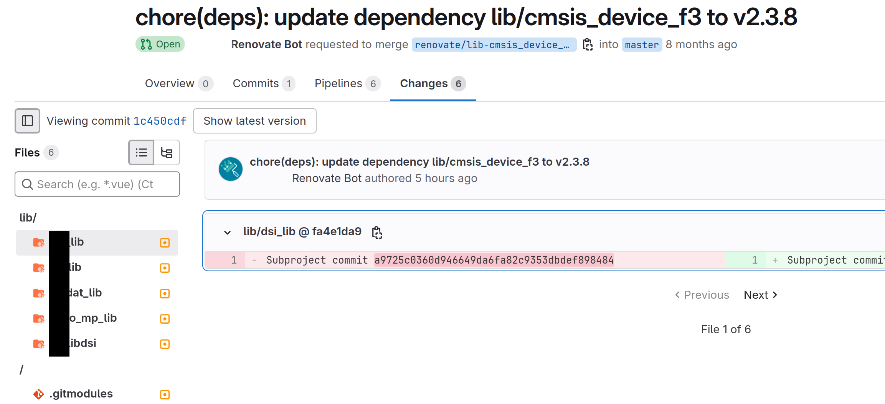
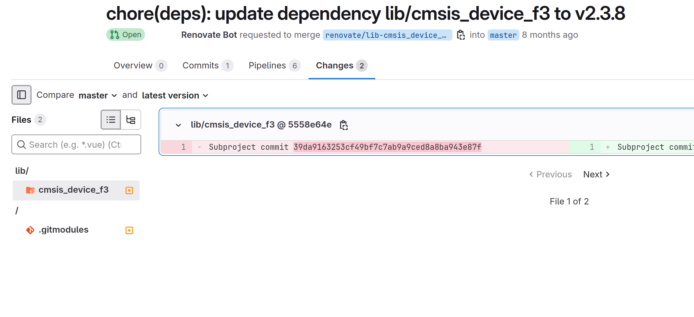

# 40858 - v43: postUpgradeTasks consisting of three commands, different behavior between shell chaining and three single commands in postUpgradeTasks

## Current behavior

With the new preset adapted to `allowShellExecutorForPostUpgradeCommands=false`, we get all updated submodule files in each merge request of every dependency (in both MRs, e.g. of moduleA there are expected changes plus undesired changes of the other modules from separate updates).

## Expected behavior

Previously we had two changed files per submodule dependency in a merge request (e.g. moduleA -> two changes in one MR, moduleB -> two changes in another MR, etc.).

## Link to the Renovate issue or Discussion

https://github.com/renovatebot/renovate/discussions/40858
